[README_project3.md](https://github.com/user-attachments/files/25696104/README_project3.md)
# 🔮 Customer Churn Prediction with SHAP Explainability

## Overview
Binary classification model to predict customer churn, with **SHAP explainability** to identify WHY customers leave — turning black-box predictions into actionable business intelligence.

**Built by:** Nithin Kumar Kokkisa — Senior Demand Planner with 12+ years in manufacturing operations & supply chain analytics.

---

## Business Problem
Customer churn directly impacts revenue. Predicting which customers will leave — and understanding the driving factors — enables proactive retention strategies. This project builds a predictive model and provides interpretable, customer-level explanations for every prediction.

## Dataset
- **Source:** Telco Customer Churn (IBM / Kaggle)
- **Size:** 7,043 customers, 21 features
- **Target:** Binary — Churn (Yes/No), ~27% churn rate
- **Features:** Tenure, contract type, monthly charges, internet service, payment method, etc.
- **Split:** 80% train / 20% test (stratified)

## Models Compared

| Model | Approach | Strengths |
|-------|----------|-----------|
| **Logistic Regression** | Probability-based linear classifier | Simple, fast, interpretable baseline |
| **Random Forest** | Ensemble of 200 decision trees | Robust, handles non-linear patterns, built-in feature importance |

## Key Results

| Metric | Logistic Regression | Random Forest |
|--------|-------------------|---------------|
| Accuracy |  |  |
| Precision |  |  |
| Recall |  |  |
| F1-Score |  |  |
| AUC-ROC |  |  |


## SHAP Explainability — Key Findings

### Top Churn Drivers (from SHAP analysis):
1. **Low tenure** — New customers are highest risk
2. **Month-to-month contract** — No commitment = easy to leave
3. **High monthly charges** — Price sensitivity drives churn
4. **Fiber optic internet** — Possible service quality issues
5. **No tech support** — Poor support experience increases risk
6. **Electronic check payment** — Less engaged customers

## Visualizations

### EDA
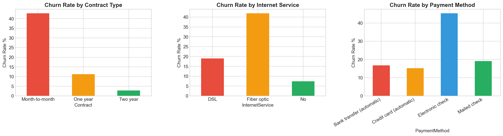
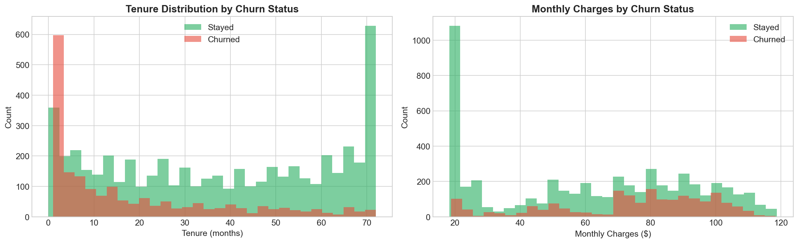
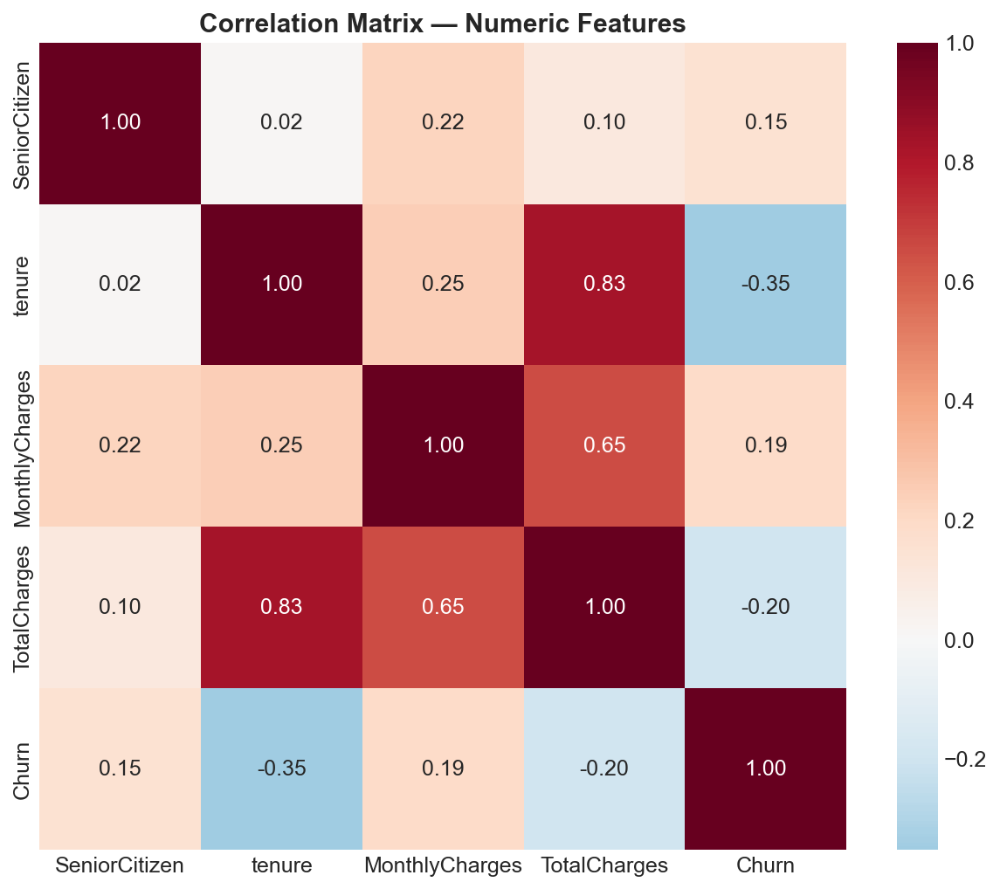

### Model Performance
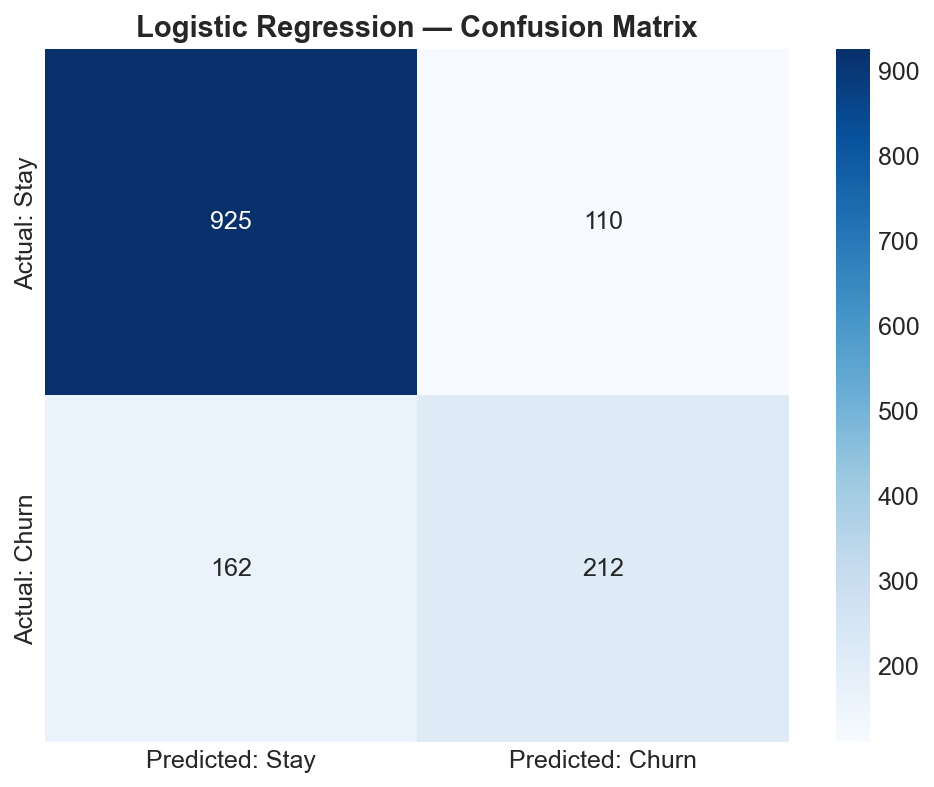
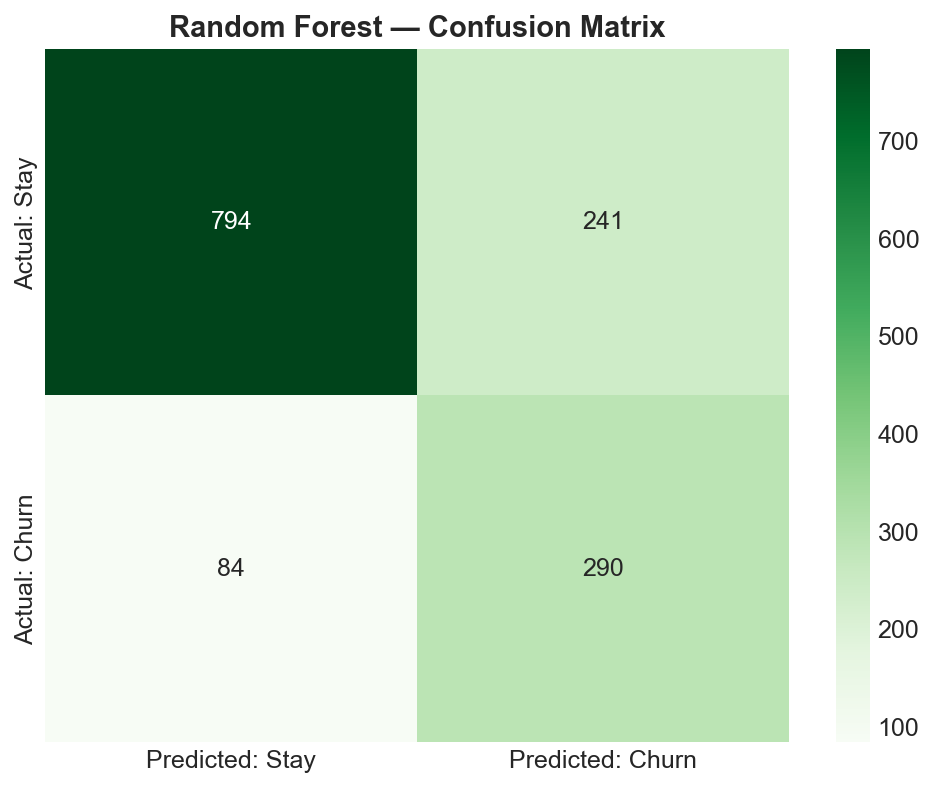
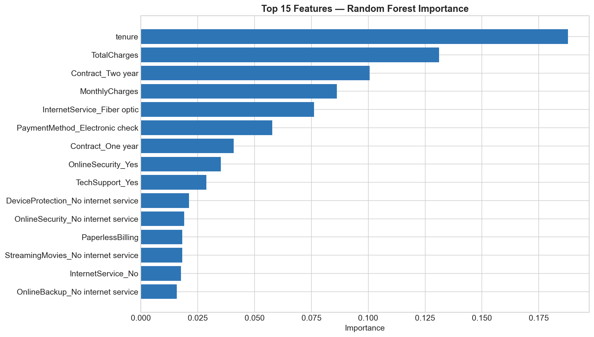
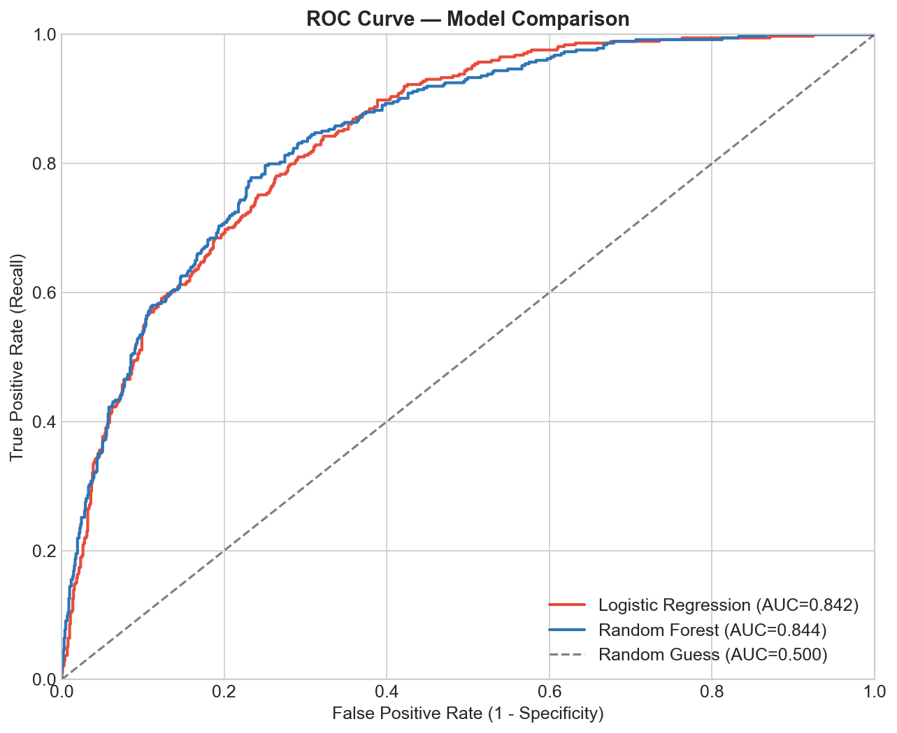

### SHAP Explainability
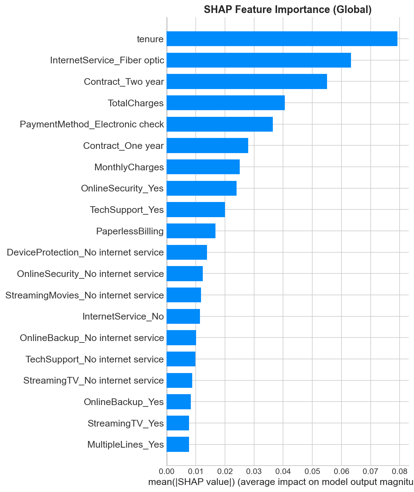
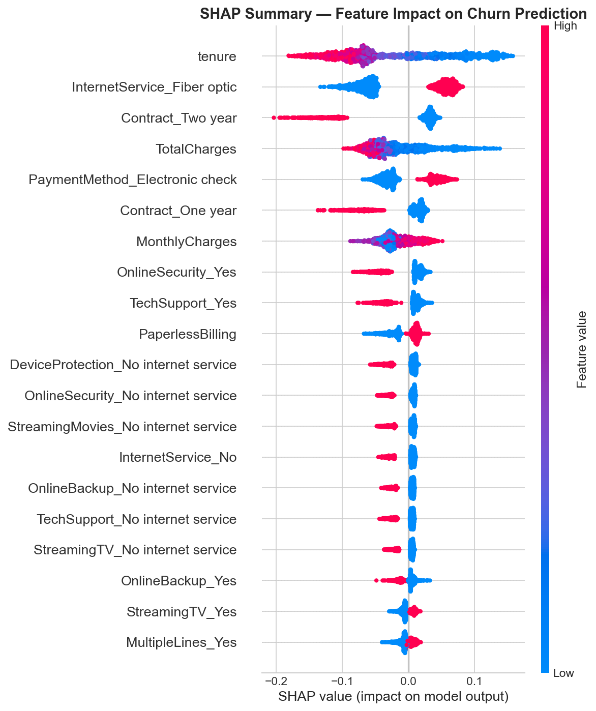
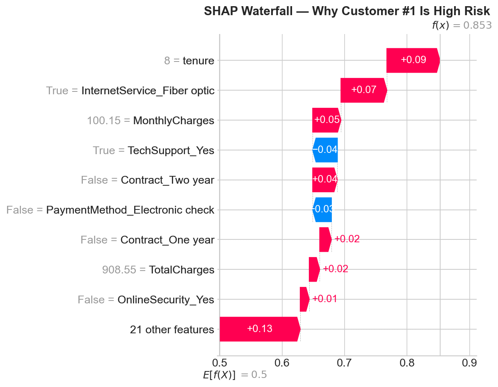
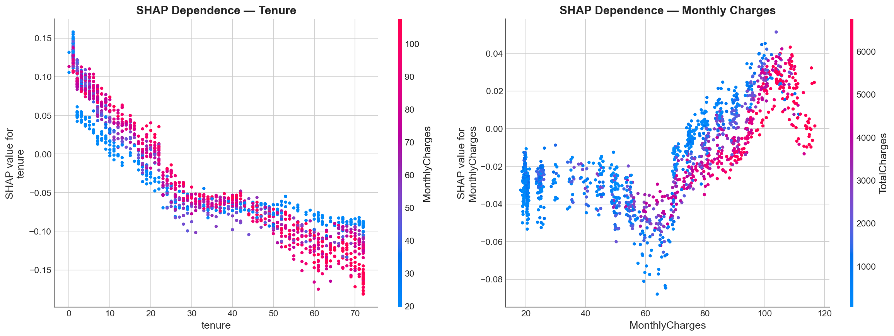

## Business Recommendations
1. **Early intervention** for customers in first 6 months
2. **Contract incentives** — discounts for annual/two-year commitments
3. **Pricing review** for customers paying >$80/month
4. **Fiber optic quality** investigation
5. **Support bundling** with tech support and online security
6. **Auto-pay encouragement** to reduce friction

## Tools & Technologies
- **Python** (Pandas, NumPy, Matplotlib, Seaborn)
- **scikit-learn** (Logistic Regression, Random Forest, metrics)
- **SHAP** (SHapley Additive exPlanations for model interpretability)
- **Classification Metrics** (Confusion Matrix, Precision, Recall, F1, AUC-ROC)

## How to Run
```bash
pip install shap scikit-learn pandas numpy matplotlib seaborn
python project3_churn_prediction.py
```

---

## About
Part of a **30-project data analytics portfolio**. See [GitHub profile](https://github.com/Kokkisa) for the full portfolio.

**Previous:** [Project 1 — Demand Forecasting with Prophet](https://github.com/Kokkisa/demand-forecasting-prophet) | [Project 2 — ARIMA vs Prophet vs ETS](https://github.com/Kokkisa/forecasting-model-comparison)
